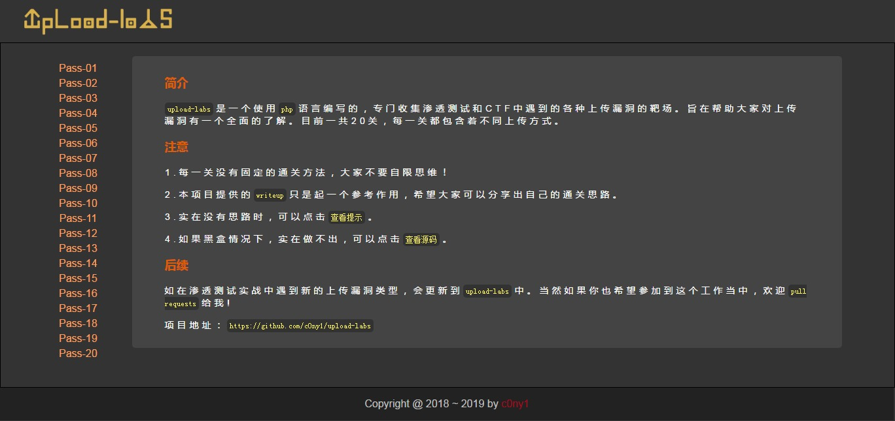
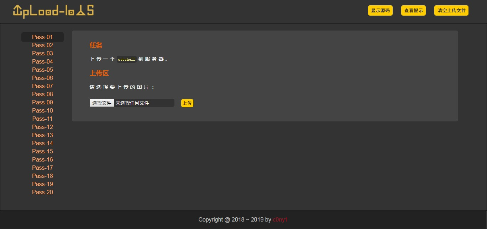
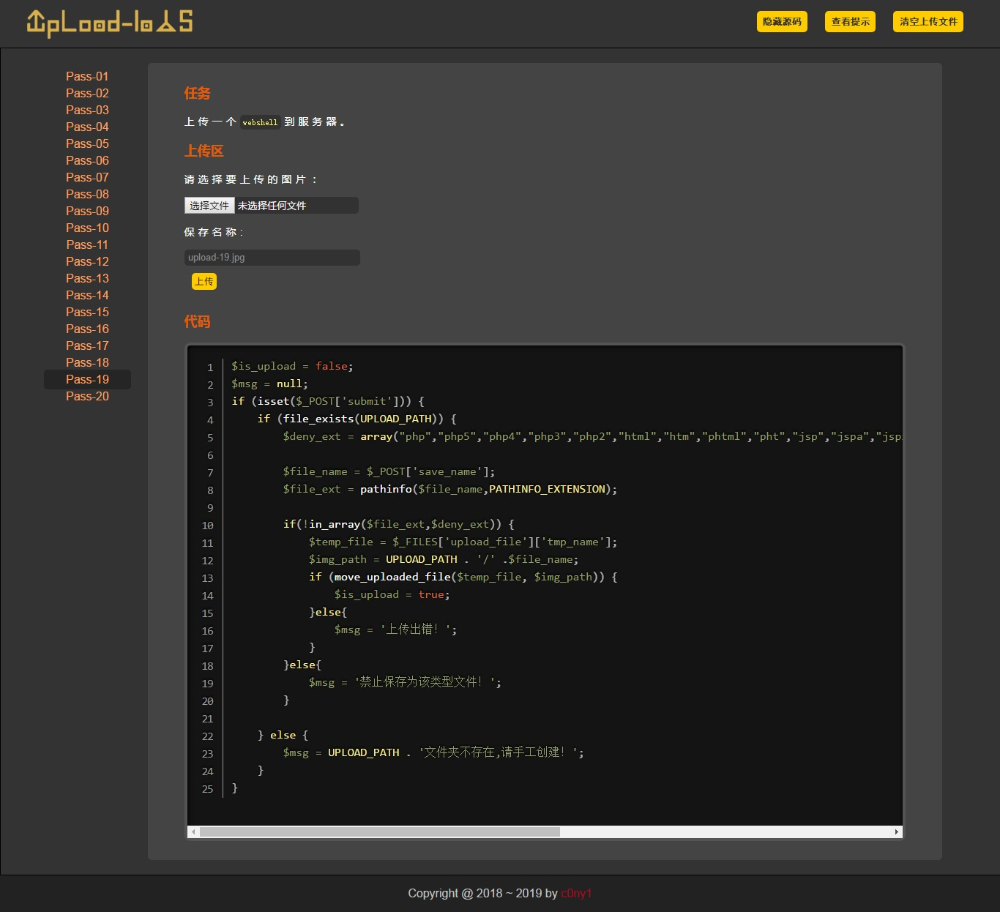
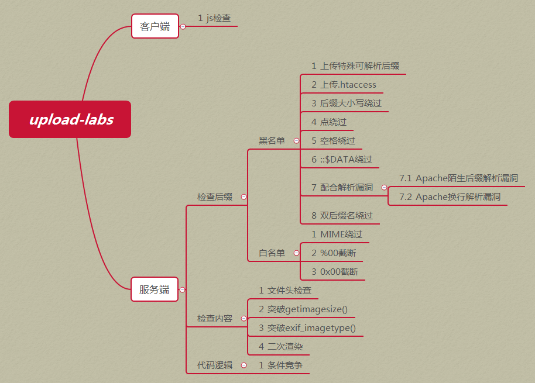
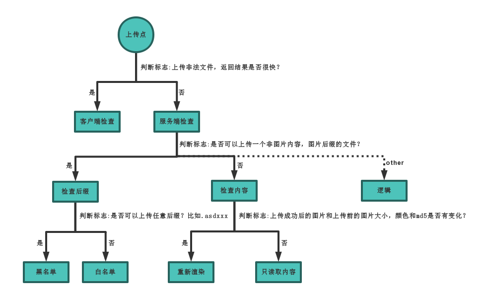

<p align="center">
  
</p>

<p align="center">
  
  
  
</p>

---

> **upload-labs** is a PHP-based lab specifically designed to collect various file upload vulnerabilities encountered in penetration testing and CTF challenges. Its goal is to help users gain a comprehensive understanding of file upload vulnerabilities. The project currently includes **20 levels**, each demonstrating a different file upload technique.

## 0x01 Screenshot

#### 1.1 Home Page



#### 1.2 Each Level



#### 1.3 View Code



## 0x02 Install

#### 2.1 Environmental Requirements

If you want to set up the environment yourself, please configure the environment as follows to run each pass properly.

|Configuration items|disposition|description|
|:---|:---|:---|
|operating system|Window or Linux|Windows is recommended, except for Pass-19, which must be under linux, the rest of the passes can be run on Windows|
|PHP version|Recommend 5.2.17|Other versions may cause some passes to not be broken|
|PHP components|php_gd2,php_exif|Some passes rely on these two components|
|Middleware|Set up Apache to connect in moudel mode||

#### 2.3 Docker quick setup

Create an image

```bash
cd upload-labs/docker
docker build -t upload-labs .
```

Create a container

```bash
docker run -d -p 8080:80 upload-labs:latest
```

## 0x03 Summary

#### 3.1 The target machine contains a classification of vulnerability types



#### 3.2 How do I determine the type of upload vulnerability?



## 0x04 Thanks

* Credit to [c0ny1](https://github.com/c0ny1) for his work. Using Google translate, i translated to English.
